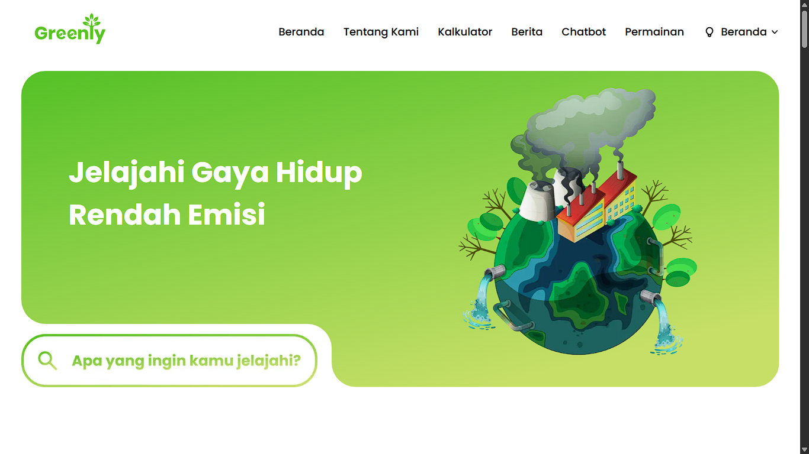

# 🌿 Greenly — Website Edukasi & Aksi Lingkungan

---

## 📝 Deskripsi

**Greenly** adalah platform web bertema **lingkungan** untuk mengedukasi, mengukur, dan mengajak pengguna beraksi menjaga bumi.  
Fokus utama Greenly adalah memberi alat praktis (kalkulator emisi, pengenal sampah, kartu edukasi, permainan) serta kanal **chatbot** untuk bertanya seputar eco-lifestyle.

Dibangun dengan **Next.js + TypeScript** di frontend, **Python** untuk logika/AI service, **MySQL** sebagai database, dan **Tailwind CSS** untuk tampilan yang modern dan responsif.

---

## 🚀 Teknologi

| Teknologi | Kegunaan |
|-----------|----------|
|  | Framework React untuk SSR/SSG & routing modern. |
|  | Keamanan tipe & maintainability. |
|  | Styling cepat, konsisten, dan responsif. |
|  | Layanan micro-service (perhitungan emisi, model klasifikasi sampah, dsb.). |
|  | Database relasional (data emisi, riwayat kuis/permainan, kartu edukasi). |

---

## ✨ Fitur Utama

### 1) 📉 Kalkulator Emisi  
Hitung jejak karbon harian/bulanan (transportasi, listrik, makanan). Simpan riwayat & dapatkan rekomendasi penurunan emisi.

### 2) 💬 Chatbot  
Tanya apa saja soal gaya hidup hijau—dari pemilahan sampah hingga tips hemat energi. Mendukung tanya jawab cepat dan link ke sumber belajar.

### 3) 🗑️ Kenali Sampah  
Kenali kategori sampah (organik, anorganik, B3, daur ulang, kompos) dengan panduan praktis dan contoh. (Opsional: integrasi model Python untuk klasifikasi gambar.)

### 4) 🧠 Kartu Edukasi  
Kumpulan kartu topik (energi, air, plastik, transport) dengan ringkasan, fakta, dan tindakan kecil yang bisa dilakukan hari ini.

### 5) 🎮 Permainan  
Mini-games bertema lingkungan (quiz/tebak kategori/drag-and-drop pemilahan) untuk belajar sambil seru. Skor tersimpan di profil.

---

## 🌍 Manfaat
- Membantu masyarakat memahami isu lingkungan dengan cara yang mudah dan interaktif.  
- Menyediakan media edukasi digital ramah pengguna untuk semua kalangan.  
- Mendorong aksi nyata dalam mengurangi dampak lingkungan sehari-hari.  

---

## 🎯 Tujuan
- Memberikan informasi dan edukasi terkait keberlanjutan dan gaya hidup ramah lingkungan.  
- Mengajak pengguna menghitung, mengenali, dan mengurangi jejak karbon pribadinya.  
- Menjadi referensi digital yang terpercaya untuk pembelajaran dan aksi peduli bumi.  

---

## 📝 Penutup
**Greenly** hadir sebagai solusi sederhana namun bermanfaat bagi masyarakat untuk belajar sekaligus beraksi menjaga lingkungan.  
Dengan fitur-fitur yang interaktif, Greenly diharapkan dapat menginspirasi pengguna agar lebih peduli terhadap bumi dan berkontribusi dalam menciptakan masa depan yang lebih hijau. 🌱✨  

---

## 📜 Lisensi

Proyek ini dirilis di bawah lisensi **MIT**. Silakan gunakan, modifikasi, dan kembangkan untuk kepentingan edukasi dan aksi lingkungan.

---